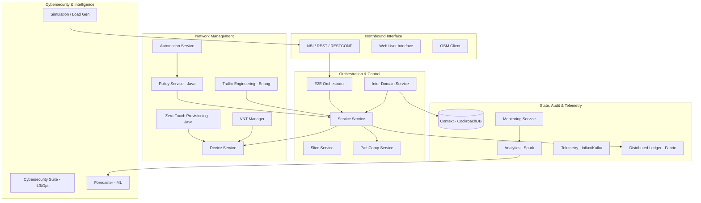

# TeraFlowSDN High-Level Design & Architecture

TeraFlowSDN (TFS) is a cloud-native SDN controller designed for carrier-grade networks. It follows a microservices-based architecture where each component is containerized and communicates via gRPC.

## Architecture Overview

The TeraFlowSDN controller is built using a modular microservice architecture. While the framework supports a wide range of advanced features (Cybersecurity, DLT, Analytics), a standard "Core" deployment focuses on basic connectivity orchestration.

> [!NOTE]
> In the current environment, only the **Core Services** are active. Advanced components are documented based on their source code implementation but are disabled by default to optimize resource usage.

The system is logically divided into three layers:
1. **Management Layer**: Handles external requests (NBI, WebUI).
2. **Control Layer**: Core logic (Service, PathComp, Slice, Context).
3. **Enforcement Layer**: Interacts with physical/virtual hardware (Device, Drivers).

### Component Interaction Graph

## Functional Blocks

### 1. Orchestration Layer
- **E2E Orchestrator**: Manages end-to-end services across multiple layers (IP, Optical) or domains.
- **Service & Slice**: Core logic for managing network services and isolated slices.
- **Inter-Domain**: Federates multiple TFS instances to enable cross-provider connectivity.

### 2. Intelligent Management
- **TE (Traffic Engineering)**: Advanced path optimization and resource management (Erlang-based).
- **VNTM (Virtual Network Topology Manager)**: Maintains an abstract, virtualized view of the network for various control applications.
- **ZTP & Policy**: Automates device onboarding and enforces administrative constraints.

### 3. Service Assurance
- **Forecaster**: Uses historical data to predict future performance metrics and potential congestion.
- **Analytics & Telemetry**: High-performance pipeline (Spark/InfluxDB/Kafka) for collecting and processing network measurements.
- **Load Generator (Simulation)**: Integrated tool for simulating network traffic and service requests to validate controller performance.

### 4. Security & Auditing
- **Cybersecurity Suite**: Multi-layered detection (L3/Optical) using ML and Anomaly Detection.
- **DLT (Distributed Ledger)**: Based on Hyperledger Fabric, providing a tamper-proof audit trail for all service configurations and security events.

## Service Ecosystem

### Core Control Plane
- **Context Service**: Central repository for topology and state.
- **Device & Service Services**: Manage physical devices and logical service lifecycles.
- **Slice Service**: Orchestrates end-to-end network slices.

### Advanced Capabilities
- **[QKD Management](file:///Users/perkunas/.gemini/antigravity/scratch/teraflow-code/docs/qkd_capability.md)**: Orchestrates quantum key distribution applications.
- **[E2E Orchestration](file:///Users/perkunas/.gemini/antigravity/scratch/teraflow-code/docs/e2e_orchestration.md)**: Coordinates services across multiple administrative domains.
- **[Optical Control & VNT](file:///Users/perkunas/.gemini/antigravity/scratch/teraflow-code/docs/optical_control.md)**: Manages physical optical resources and virtual network links.
- **[Zero-Touch Provisioning](file:///Users/perkunas/.gemini/antigravity/scratch/teraflow-code/docs/ztp_inventory.md)**: Automates device onboarding and inventory management.
- **[Policy Management](file:///Users/perkunas/.gemini/antigravity/scratch/teraflow-code/docs/policy_management.md)**: Enforces SLAs and automated remediation rules.

### Monitoring & Analytics
- **[Monitoring & Analytics Suite](file:///Users/perkunas/.gemini/antigravity/scratch/teraflow-code/docs/monitoring_analytics.md)**: Real-time telemetry collection and Spark-based data analysis.

### Northbound Interfaces
- **[NBI Gateway](file:///Users/perkunas/.gemini/antigravity/scratch/teraflow-code/docs/nbi_interfaces.md)**: Standardized access via TAPI, IETF-NS, and RESTCONF.

## Data Persistence
- **CockroachDB**: Distributed SQL store for long-term network state.
- **InfluxDB / QuestDB**: Optimized for high-velocity telemetry data.
- **Kafka / NATS**: Event-driven communication backbone.
- **Hyperledger Fabric**: Decentralized ledger for mission-critical auditing.

## Service Fulfillment Workflow

1. **Service Request**: A request is received via NBI or WebUI.
2. **Path Computation**: The `Service` microservice queries `PathComp` for a suitable path.
3. **Task Scheduling**: `Service` builds a task DAG to configure the required connections.
4. **Device Configuration**: `Service` calls the `Device` microservice to apply configurations to specific endpoints.
5. **State Update**: All changes are persisted in the `Context` service.
6. **Confirmation**: The service status is updated to `ACTIVE`.
